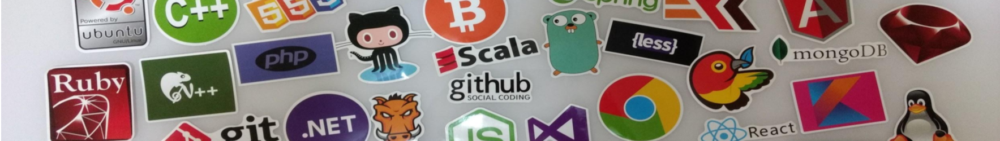
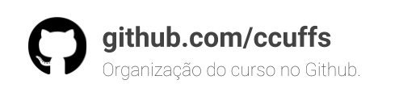
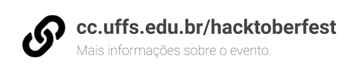

# Hacktoberfest

Contribua com os projetos de código aberto do curso no Github durante o mês de outubro e ganhe prêmios por isso! 

## Premiação

Você ganha por cada pull request emitido em seu nome para qualquer um dos repositórios do curso listados em https://github.com/ccuffs. Para  garantir  que  todos  tenham  chance  de  ganhar  algo,  os  prêmios  serão  dados da seguinte forma: 

| Pull requests feitos por você e aceitos pelo(s) mantenedor(es) do projeto  | PREMIAÇÃO |
|:---:|:---:|
| 1  | 1 adesivo |
| 2  | Concorre no sorteio de uma camiseta do curso |
| 4  | 1 adesivo |
| 8  | 1 adesivo |
| 16*  | Coordenador trabalha um dia inteiro usando um sombreiro Mexicano |

> *= Vamos trabalhar para isso, Padawan! São 16 pull requests feitos por uma única pessoa. Os pull requests precisam ser feitos e aceitos nos seguintes repos (obrigatoriamente): ccuffs/busy, ccuffs/cc.uffs.edu.br, ccuffs/app-cc, ccuffs/ideias, dovyski/opengl-demos. O mundo não é um moranguinho.

## Participe

Durante todo o mês de outubro, haverá atividades para que os alunos aprendam sobre git, incrementem seus portfólios, e deixem seu perfil no Github cheio de coisas lindas! 

