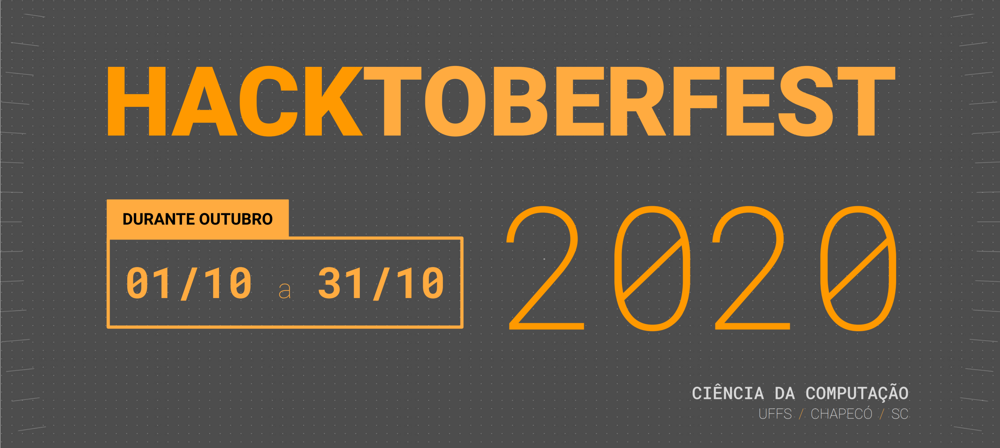

# Hacktoberfest

Contribua com os projetos de código aberto do curso no [Github](https://github.com) durante o mês de outubro e ganhe prêmios por isso! Convide seus amigos e colegas para contribuir compartilhando o link [https://uffs.cc/hf](uffs.cc/hf).

> **DICA:** é novo com git? Sem problema! Dê uma olhada nesse [tutorial rápido](docs/tutorial-git-basico.md) ou nesse [guia básico](https://github.com/mateusKoppe/git-guia-basico).

## Premiação

Você ganha por cada novo _issue_ ou _pull request_ emitido em seu nome para qualquer um dos repositórios do curso listados em [https://github.com/ccuffs](github.com/ccuffs). Para  garantir  que  todos  tenham  chance  de  ganhar  algo,  os  prêmios  serão  dados da seguinte forma: 

| AÇÃO  | PREMIAÇÃO * |
|:---:|:---:|
| Abrir issue nova  | 1 adesivo |
| Criar um pull request  | 1 adesivo |
| Criar um pull request que resolve uma issue marcada como `hacktoberfest` | 1 camiseta personalizada Hacktoberfest 2020 CC UFFS |

> *= As contribuições precisam ser feitas nos repositórios listados em [https://github.com/ccuffs](github.com/ccuffs), mesmo que esses sejam forks. Issues novas precisam ser, pelo menos, relacionadas com o repositório onde foram abertas. 

## Participe

Durante todo o mês de outubro, haverá atividades para que os alunos aprendam sobre git, incrementem seus portfólios, e deixem seu perfil no Github cheio de coisas lindas! 

